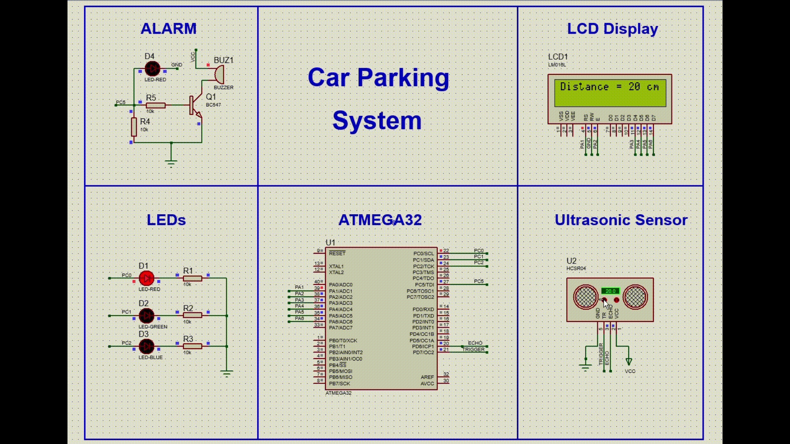

# 🚗 Smart Car Parking Assistant System  

 

## Overview  
This project is a **Smart Car Parking Assistant System** implemented on an **AVR microcontroller (ATmega32)** and simulated in **Proteus**. It uses an **ultrasonic sensor** to measure the distance between the car and nearby objects, giving real-time feedback via an **LCD**, **LED indicators**, and a **buzzer alarm**.  

The goal is to assist drivers in safe parking by providing distance-based visual and auditory alerts.

---

## Features  

✔ **Ultrasonic Distance Measurement**  
- Real-time object detection using the **HC-SR04** ultrasonic sensor  
- Accurate distance calculation through an **Input Capture Unit (ICU)**  

✔ **LCD Display**  
- Displays the measured distance in centimeters  
- Continuously updated for real-time feedback  

✔ **Dynamic LED Indicators**  
- Distance-based color-coded LED feedback:  
  - **15–20 cm**: 🔴 Red ON  
  - **10–15 cm**: 🔴 Red + 🟢 Green ON  
  - **5–10 cm**: 🔴 Red + 🟢 Green + 🔵 Blue ON  
  - **< 5 cm**: All LEDs **flash** and the **buzzer sounds** for immediate alert  

✔ **Buzzer Alarm**  
- Activates when the object is dangerously close (less than 5 cm)  
- Helps the driver react quickly in tight spots  

✔ **Modular Driver Development**  
- Created reusable, hardware-independent drivers for:  
  - **Ultrasonic Sensor**  
  - **ICU (Input Capture Unit)**  
  - **GPIO**  
  - **LCD Display**  
  - **LEDs**  
  - **Buzzer**

---

## Components Used  

- **ATmega32 (Microcontroller)**  
- **Ultrasonic Sensor (HC-SR04)**  
- **16x2 LCD Display**  
- **Red, Green, and Blue LEDs**  
- **Buzzer**  
- **Resistors, transistors, and other supporting components**  
- **Proteus** for simulation  
- **AVR-GCC / Eclipse** for code compilation  

---

## Proteus Simulation  

### Circuit and Simulation  
The system is designed and simulated in **Proteus**. It includes:  
- HC-SR04 sensor connected via trigger and echo pins  
- LCD (4 bit data mode) connected to **PA3-PA6**  
- LEDs wired to **PC0,PC1 and PC2**
- Buzzer wired to **PC5**
- **ICU** used for accurate pulse width measurement from the echo signal  
- Drivers ensure clean modular design for reusability and scalability  

---

## How It Works  

1. **Startup**: System begins ultrasonic distance measurement in a loop.  
2. **Distance Measurement**: ICU captures pulse from the echo pin to calculate the distance.  
3. **Visual Output**:  
   - Distance is shown on the LCD.  
   - LEDs light up depending on the measured range:  
     - 15–20 cm → 🔴  
     - 10–15 cm → 🔴🟢  
     - 5–10 cm → 🔴🟢🔵  
     - < 5 cm → All flash + buzzer ON  
4. **Alarm**: Buzzer is triggered when a dangerous proximity is detected (< 5 cm).

---

## How to Simulate in Proteus  

1. Open **Proteus** and load the circuit design file.  
2. Compile the C code in **AVR-GCC** or **Atmel Studio** and generate a `.hex` file.  
3. Load the `.hex` into the ATmega32 in Proteus.  
4. Run the simulation and interact by adjusting the distance of an object to the ultrasonic sensor.  

---

## Future Improvements  

- EEPROM storage to log closest detected distance  
- UART interface for PC feedback or logging  
- Integration with automated braking systems  

---

## Author  
👤 **Malik Babiker**  
📅 **March 24, 2025**

This project was a great opportunity to explore **driver development**, **ultrasonic sensing**, and **real-time embedded feedback systems** — an essential step forward in my embedded systems journey! 🚀  
